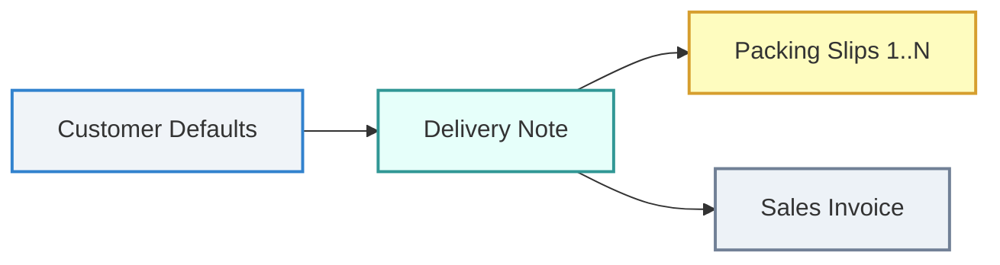

# Core Customizations

Customizations and 3PL Logistics Workflows for Frappe / ERPNext.

---

## 3PL Logistics & Distribution Architecture

The logistics and dispatch workflows are decoupled from financial billing documents (`Sales Invoice`) and centralized into the **`Customer`** $\rightarrow$ **`Delivery Note`** $\rightarrow$ **`Packing Slip`** lifecycle.



---

## 1. Customer Master Defaults

Configured under **Customer $\rightarrow$ Transporter & Shipping Settings**:

* **Default Transporter**: Link to `Supplier` (filtered with `is_transporter: 1`).
* **Default Origin / Booking Hub Address**: Booking office / hub address (e.g. Parrys booking hub). Dynamically filtered by the selected Transporter.
* **Is Godown Delivery**: Toggle for Transporter Godown pickup vs Door Delivery. Only appears when an Origin Hub is selected.
* **Default Destination Godown Address**: Destination godown address where the customer will collect the shipment. Mandatory when Godown Delivery is enabled.

---

## 2. Delivery Note Logistics Actions

When a Delivery Note is created for a Customer, all Transporter defaults and sanitized address blocks (with GSTIN) are automatically inherited.

The Delivery Note form provides dedicated action buttons under the **`Logistics`** dropdown:

### A. `Logistics >> Transporter`
* Opens an interactive modal to view or update Transporter, Origin Hub, and Destination Godown.
* Displays live HTML address preview cards with GSTIN.
* Supported in both **Draft** and **Submitted** states.

### B. `Logistics >> Update LR Details`
* Dedicated modal to record or update the **Lorry Receipt (LR) / Consignment Number** and **LR Date** once handed over to the transport agency.

---

## 3. Packing Slips & Carton Management

A dedicated **`Packing Slips`** dropdown on the `Delivery Note` handles warehouse box-packing and 4x6" thermal label printing:

```
Delivery Note
 └── Packing Slips
      ├── Generate
      ├── Edit / Cancel
      ├── Print Single
      └── Print Bulk
```

### A. `Packing Slips >> Generate`
* **Single Item Cartons**: Select an item and case pack quantity; auto-calculates and generates sequential boxes (`Box 1`, `Box 2`, etc.).
* **Mixed Items Carton**: Pack remaining loose balances or multiple item codes into a single mixed box.
* **Line Item References**: Automatically sets `dn_detail` linkage on each `Packing Slip Item` to comply with ERPNext stock validation.
* **Draft by Default**: Saves generated Packing Slips as **Draft (`docstatus: 0`)** for review before dispatch.

### B. `Packing Slips >> Edit / Cancel`
* Lists all packed boxes with item summaries and quantities.
* Allows one-click deletion of individual boxes or deleting all boxes to repack.

### C. `Packing Slips >> Print Single`
* Prompts for a box number and opens the **`Carton Shipping Label (4x6)`** thermal label for that specific carton.

### D. `Packing Slips >> Print Bulk`
* Generates a multi-page, continuous print stream rendering 4x6" thermal labels for **all boxes sequentially** (`BOX 1 OF N` through `BOX N OF N`) and automatically triggers the print dialog.

---

## 4. Document Lifecycle & Submissions

* **Auto-Submission**: When the `Delivery Note` is submitted, all linked Draft `Packing Slip` documents are automatically submitted (`docstatus: 1`).
* **Auto-Cancellation**: If the `Delivery Note` is cancelled, all linked `Packing Slip` documents are automatically cancelled (`docstatus: 2`).
* **Mandatory Delivery Note on Sales Invoice**: `Sales Invoice` items must be linked to a valid `Delivery Note`. Direct invoice creation without a delivery note is blocked.

---

## 5. Thermal Print Formats (4" x 6")

* **`Carton Shipping Label (4x6)`** *(DocType: `Packing Slip`)*:
  * Dynamic `BOX [ X ] OF [ Y ]` count.
  * Barcode encoding Packing Slip ID.
  * Consignee (Customer) delivery address or Godown Pickup banner.
  * Transporter Origin Hub & Destination Godown with GSTIN.
  * Sender (Consignor) company information.
* **`Shipping Package Label (4x6)`** *(DocType: `Delivery Note`)*.

---

## 6. Running Integration Tests

Run the full 13-test integration suite:

```bash
bench --site [site-name] run-tests --module core_customizations.tests.test_delivery_note_workflow
```

Run print format tests:

```bash
bench --site [site-name] run-tests --module core_customizations.tests.test_pos_label_print_formats
```

---

## Pre-requisites & Installation

1. ERPNext Company & Master Setup completed.
2. Run database migration and fixture sync:
   ```bash
   bench --site [site-name] migrate
   ```
