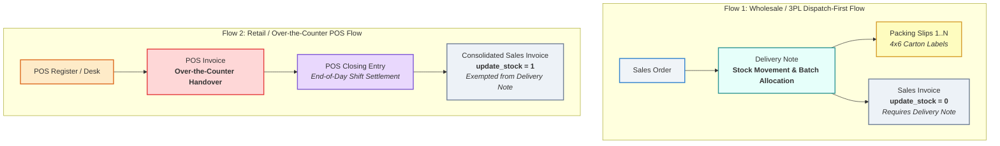
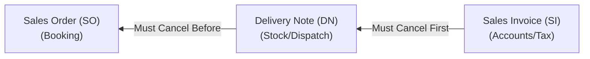

# Core Customizations

Customizations, 3PL Logistics Workflows, and Dual Sales Architecture for Frappe / ERPNext.

---

## 1. Dual Sales & Fulfillment Architecture

The system supports two distinct sales and fulfillment flows designed for different operational channels:



---

## 2. Sales Returns & Credit Notes Lifecycle

Sales returns are handled specifically for each channel to preserve stock accuracy and tax compliance:

### A. Wholesale / B2B Return Flow (`SO` $\rightarrow$ `DN` $\rightarrow$ `SI`)
* **Physical Stock Return (Warehouse)**:
  * A **Delivery Note Return** is created against the original `Delivery Note` (`is_return: 1`, negative quantity).
  * Increases stock in the warehouse and restores batches.
* **Financial Credit Adjustment (Accounts)**:
  * A **Sales Invoice Return (Credit Note)** is generated against the original `Sales Invoice` (`is_return: 1`, `update_stock: 0`).
  * Reverses Accounts Receivable, revenue, and output GST.
  * **Validation Rule**: In `sales_invoice.py`, return invoices (`is_return: 1`) bypass the forward Delivery Note requirement.

### B. Retail / POS Return Flow (`POS` $\rightarrow$ `POS Invoice`)
* **Immediate Counter Refund**:
  * Cashier selects **"Return"** in the POS UI, creating a `POS Invoice` with negative quantities (`is_return: 1`).
  * Stock is immediately returned to the shelf/godown, and cash/card refund is issued to the customer.
* **Shift Settlement**:
  * The **POS Closing Entry** consolidates daily sales and returns into net revenue and consolidated Credit Note entries.

---

## 3. 3PL Logistics & Transporter Management

Logistics and transport settings are decoupled from billing and centralized into the **`Customer`** $\rightarrow$ **`Delivery Note`** $\rightarrow$ **`Packing Slip`** lifecycle.

### Customer Master Defaults
Configured under **Customer $\rightarrow$ Transporter & Shipping Settings**:
* **Default Transporter**: Linked `Supplier` (filtered with `is_transporter: 1`).
* **Origin / Booking Hub Address**: Dynamic booking office address (e.g. Parrys Booking Hub).
* **Is Godown Delivery**: Toggle for Transporter Godown pickup vs Door Delivery.
* **Destination Godown Address**: Customer's designated collection godown.

### Delivery Note Logistics Actions
* **`Logistics >> Transporter`**: Interactive modal to view or update Transporter, Origin Hub, and Destination Godown with live HTML address preview cards.
* **`Logistics >> Update LR Details`**: Modal to update Lorry Receipt / Consignment No (`lr_no`) and Date (`lr_date`).

---

## 4. Single Warehouse Confinement on Delivery Note

A Delivery Note is strictly confined to dispatching from a **single warehouse**:
* **Client-Side Trigger**: When editing the `warehouse` on any item row, if another warehouse is already set by earlier items, the form alerts the dispatcher and automatically reverts the row to the primary warehouse.
* **Server-Side Validation**: `validate_delivery_note` in `delivery_note.py` verifies all item rows belong to the same warehouse before save/submission.

---

## 5. Packing Slips & Carton Management

Accessible via the **`Packing Slips`** dropdown on `Delivery Note`:
* **`Generate`**: Generates single-item or mixed-item cartons with automatic `dn_detail` linkage, saved as Draft (`docstatus: 0`).
* **`Manage / Edit`**: Table view of all carton boxes with status, packed items, individual box deletion, or bulk repacking.
* **`Submit Draft Slips`**: One-click submission of draft packing slips.
* **`Print Single`**: Prompts for a box number to print its 4x6" thermal label.
* **`Print Bulk`**: Generates a continuous multi-page print stream of all carton labels (`BOX 1 OF N` to `BOX N OF N`).

---

## 6. Document Cancellation & Dependency Guardrails

Strict relational dependency validation is enforced across the entire order fulfillment lifecycle:



### Dependency Cancellation Rules:
1. **Sales Order Cancellation (`SO`)**:
   * **Blocked** if any submitted `Delivery Note` or `Sales Invoice` is linked.
   * Attempting to cancel an SO with an active downstream document throws `LinkValidationError`.
2. **Delivery Note Cancellation (`DN`)**:
   * **Blocked** if an active submitted `Sales Invoice` references it (`Sales Invoice Item.delivery_note`).
   * Once downstream Sales Invoices are cancelled, cancelling the `Delivery Note`:
     * Auto-cancels all submitted `Packing Slip` records attached to it (via `on_cancel_delivery_note` hook).
     * Reverses Stock Ledger and Batch ledger movements.
     * Restores Sales Order's `per_delivered` % to un-delivered status.
3. **Sales Invoice Cancellation (`SI`)**:
   * **Blocked** if linked `Payment Entry` exists.
   * Cancelling the SI reverses GL accounting entries and resets the Delivery Note's `per_billed` % without cancelling the Delivery Note.
4. **Strict Reverse Cancellation Sequence**:
   $$\text{Payment Entry} \longrightarrow \text{Sales Invoice (SI)} \longrightarrow \text{Delivery Note (DN)} \longrightarrow \text{Sales Order (SO)}$$


---

## 7. Print Formats Suite

### A. Delivery Note Print Formats (A4)
Available in 3 copies (`Original for Consignee`, `Duplicate for Transporter`, `Triplicate for Supplier`):
* **3-Column Header Architecture**:
  * **Consignor (Dispatch From)**: Renders the dispatch Warehouse title, Warehouse street address, and phone number (falling back to Company Dispatch/Shipping address).
  * **Consignee (Customer)**: Renders the Customer's **Shipping Address** (`shipping_address` / `shipping_address_name`) and shipping GSTIN (falling back to billing address if no separate shipping destination).
  * **Delivery & Logistics**: Clean breakdown of Transporter name, Booking Origin Hub, Godown Delivery destination vs Door Delivery mode, LR details, Vehicle No, and Total Box count.
* **Allocated Boxes Column**:
  * Displays Box No, Quantity, and exact **Packing Slip ID** against each item (e.g. `Box #1 (4000 Nos) • MAT-PAC-2026-00358`).
  * Dedicated consolidated table for mixed item cartons.
* **No Financial Clutter**: Rates and values are omitted to focus purely on goods receipt.
* **Dual Stamp & Signature Blocks**: Receiver's Acknowledgement (Left) and Company Authorised Signatory (Right).

### B. Confidential Carton Shipping Label (4" x 6")
* **DocType**: `Packing Slip` (`Carton Shipping Label (4x6)`).
* **Anti-Pilferage Security**: Commercial product names and quantities are omitted from outer labels to protect high-value goods in 3PL transit.
* **Prominent Logistics Info**: Large `BOX [ 1 ] OF [ 5 ]` counter, Consignee Destination, Transporter Booking Hub / Godown Pickup banner, and blank routing stamp box.

### C. GST Sales Invoice Print Formats (A4)
Available in 3 copies (`Original for Receiver`, `Duplicate for Transporter`, `Triplicate for Supplier`):
* **3-Column Header Architecture**:
  * **Bill To**: Renders Customer's **Billing Address** (`address_display` / `customer_address`) and billing GSTIN.
  * **Invoice Details**: Invoice No, Date, Time, Payment Due Date, Outstanding invoices summary, and **Sales Channel: Point of Sale (POS)** (if applicable).
  * **Payment & Status**: Bank NEFT/RTGS details, dynamic UPI QR code for unpaid invoices, or green `✓ Fully Paid` badge.
* **Dual Flow Awareness in Logistics Box**:
  * **Wholesale Flow**: Displays Transporter name, Booking Origin Hub, and Godown Destination / Door Delivery.
  * **POS Flow (`is_pos: 1` / `is_consolidated: 1`)**: Replaces 3PL logistics with:
    > **Delivery Mode:** Over-the-Counter / Point of Sale (POS)  
    > **POS Profile:** [POS Profile Name]  
    > *(Consolidated POS Shift Settlement)*
* **GST Breakup Table**: Tax rate, taxable amount, and GST split.


---

## 8. Running Automated Test Suites

Run integration tests for the entire app or by specific module:

```bash
# Run ALL 61 tests across the entire app
bench --site zap.localhost run-tests --app core_customizations

# Or run individual test modules:
# 1. Delivery Note 3PL Logistics & Single Warehouse (19 tests)
bench --site zap.localhost run-tests --module core_customizations.tests.test_delivery_note_workflow

# 2. Dual Sales Architecture (Wholesale + Retail POS + Returns + Cancellation) (7 tests)
bench --site zap.localhost run-tests --module core_customizations.tests.test_pos_dual_workflow

# 3. GST Sales Invoice Print Formats Suite (10 tests)
bench --site zap.localhost run-tests --module core_customizations.tests.test_gst_invoice_print_formats

# 4. Delivery Note Print Formats Suite (with Packing Slip IDs & Shipping Address) (11 tests)
bench --site zap.localhost run-tests --module core_customizations.tests.test_delivery_note_print_format

# 5. Thermal & 4x6 Carton Shipping Labels (4 tests)
bench --site zap.localhost run-tests --module core_customizations.tests.test_pos_label_print_formats

# 6. Monkey Patches & Packing Slip Overrides (4 tests)
bench --site zap.localhost run-tests --module core_customizations.tests.test_monkey_patches

# 7. Setup & Role Permissions Provisioning (4 tests)
bench --site zap.localhost run-tests --module core_customizations.tests.test_setup_permissions

# 8. Sales Invoice Custom Fields (2 tests)
bench --site zap.localhost run-tests --module core_customizations.tests.test_sales_invoice_customizations
```

---

## 9. Installation & Migration

To synchronize all customizations, custom fields, property setters, client scripts, and print formats:

```bash
bench --site zap.localhost migrate
```


